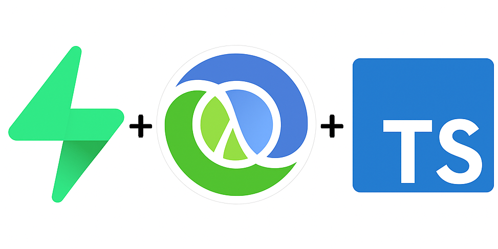

<div align="center">
  
</div>

# supabase-clj-ts

A template using all the nice features of supabase (Auth, PostgREST, Storage) with a Vite + React Typescript frontend and
an extra custom service written in Clojure.

Beware that the current extra service setup doesn't do any Auth checking (but it passes through kongs `auth-key` check).
So if you you are planning to expose sensitive data at the custom endpoint you need to implement an JWT authentication check
in the extra service. If you are not planning to expose the extra service at the frontend and only use it as service on the backend,
remove the service exposure from kong.

### Development

Bring up the development stack
```sh
cd docker
docker compose -f docker-compose.yml -f ./dev/docker-compose.dev.yml up
```

See the top of [docker-compose.yml](docker/docker-compose.yml) for more info.

Start the frontend
```sh
cd frontend
npm run dev
```

Start the backend
```sh
cd backend
clj -M:dev:nrepl
```
Jack-in with your favourite editor and start the server.
```clj
user> (init)
```

You can replace the backend with whatever server (written in your favourite language) you like.

### Deploy

You can start the whole stack (without development mode) in the docker directory by
```sh
docker compose up -d
```
This will serve the frontend at `localhost:8080`.
If you change something you need to force the builds.
```sh
docker compose up -d --build
```
